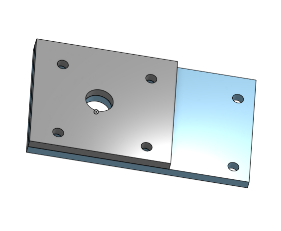
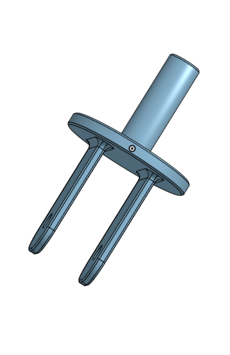
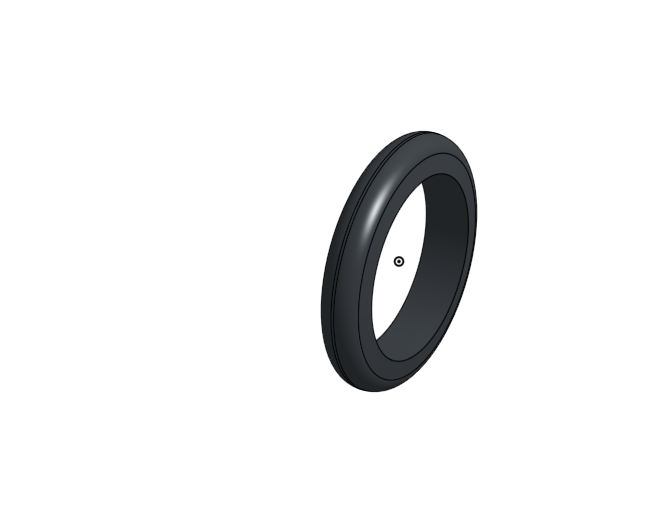
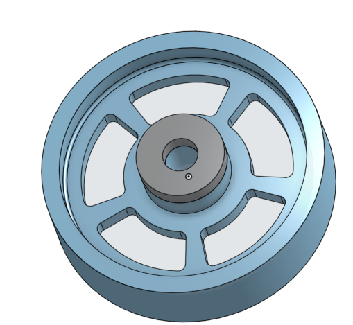
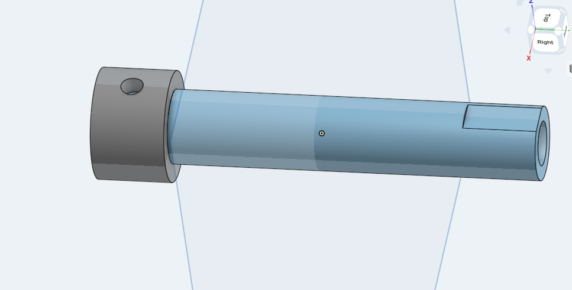
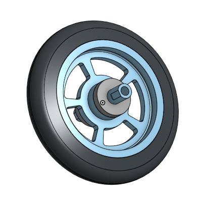
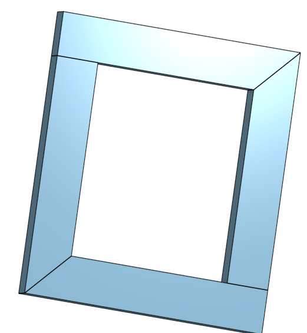

# BasicCAD

We are creating a caster.

---
## Table of Contents
* [Table of Contents](#Table-of-Contents)
* [Base](#Base)
* [Mount](#Mount)
* [Fork](#Fork)
* [Tire](#Tire)
* [Wheel](#Wheel)
* [AxleCollarBearings](#AxleCollarBearings)
* [Sub Asssembly](#Sub-Assembly)
* [Final Assembly](#Final-Assembly)
* [Dorothy's Dowel's](#Dorothy's-Dowel's)
## Base

### Description

The first assignment is to create the caster base.  The base's dimensions are 200 mm x 120 mm and 8 mm thick.  It has 6 holes 10 mm wide and 20 mm from the edge equally spaced along the edges.

### Evidence
[The Base in Onshape](https://cvilleschools.onshape.com/documents/0d70f655203ca304cb3c5b7d/w/f55603f962f6fc74f5548a68/e/41d730c570a8d75fce9f51b6)

### Image
This is how you will write image code for INTERNALLY STORED images on your repo.   just FYI.
~~~

~~~

### Reflection

This was my first Onshape part and [following along with Dr. Shields made it super easy.](https://www.youtube.com/watch?v=93BFUD-HAG8&feature=emb_title&scrlybrkr=5670f0b4)  I learned about 
* sketching (shortcut **shift-s**)
* constructions lines (shortcut **Q**)
* dimensions (shortcut **D**)
* extruding both add and remove (shortcut key **E**)
* linear patterns (no shortcut)

Onshape is awesome.  I found it really helpful to rename all my sketches.  It is going to be a GREAT year in engineering.

---

## Mount

### Description
This is exturuded out of the base and is a pretty easy part to do
### Evidence
This took me about 5 minutes
### Image

### Reflection

   This was a fun and easy part to make.
---

## Fork

### Description
This is the object that holds the Tire is was very easy to make
### Evidence
The fork took me about eight minutes to build and really helped with fillets 
### Image

### Reflection
 This was a really easy part to make and helped me learn fillets
---

## Tire

### Description
This is the wheel for out caster
### Evidence
The tire holds up the caster and is it mode of movement
### Image

### Reflection
This was an easy part to make and helped with using the revolve tool to make a tire
---

## Wheel

### Description
This is the object that holds the tire rubber and spins on the fork
### Evidence
This is the basic need to hold the fork and tire together
### Image

### Reflection
I messed up my first sketch and had to get Mr H to help Make sure you check your steck dimensions so that onshape knows the dimensions are for a revolve
---

## AxleCollarBearings

### Description
This is what hold the wheel and how it spins around
### Evidence
You need an axle and Bearings to make a wheel spin
### Image

### Reflection
I now think I know how to properly use onshape.

## Sub Assembly 

### Description
I put together my wheel tire axle and bearings in this assembly.
### Evidence
I used a fastened mate and a revolute mate to make this.
### Image

### Reflection
I think I can now really understand assemblys in onshape.

## Final Assembly

### Description
This was the entire assembly we put together all of the parts that we made in onshape here.
### Evidence
I inserted every part I made into this assembly and mated them all together.
### Image

### Reflection
I had a fun time learning cad and I am glad I finished.

## Dorothy's Dowel's

### Description 
 This was a picture frame we used for an assigment in class.
### Evidence
 We built the dowel's using configurations and built the parts by making a trapizoid
### Image

### Reflection
---
